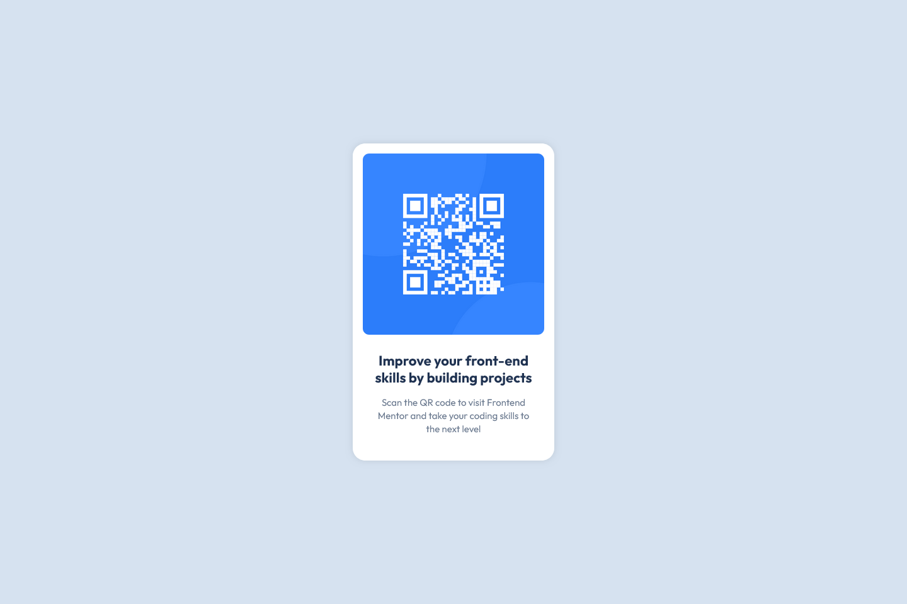

# Frontend Mentor - QR code component solution

This is a solution to the [QR code component challenge on Frontend Mentor](https://www.frontendmentor.io/challenges/qr-code-component-iux_sIO_H). Frontend Mentor challenges help you improve your coding skills by building realistic projects.

## Table of contents

- [Overview](#overview)
  - [Screenshot](#screenshot)
  - [Links](#links)
- [My process](#my-process)
  - [Built with](#built-with)
  - [What I learned](#what-i-learned)
  - [Continued development](#continued-development)
- [Author](#author)

## Overview

This project challenged me to build a responsive QR code component that focused on:

- Presents accompanying text content
- Maintains proper spacing and hierarchy
- Attention to visual details

### Screenshot




### Links

- Solution URL: [Add solution URL here](https://github.com/kamaleddy/qr-code-component.git)
- Live Site URL: [Add live site URL here](https://your-live-site-url.com)

## My process

1. Analyzed the design to identify components
2. HTML Structure
3. used CSS flexbox for centering and applied subtle shadow effects for depth
4. Test for responsive on multiple viewports (375px to 1440px)

### Built with

- Semantic HTML5 markup
- CSS custom properties
- Flexbox

### What I learned

This project deepened my understanding of modern CSS techniques, by using :root variables for maintainable styles and learned to create shadows.

```css
:root {
  --bg-color: hsl(212, 45%, 89%);
  --container-color: hsl(0, 0%, 100%);
  --main-text-color: hsl(218, 44%, 22%);
  --secondary-text-color: hsl(216, 15%, 48%);
}

.container {
  box-shadow: 0 0 10px rgba(0, 0, 0, 0.1);
}
```

### Continued development

While using the subtle box-shadow in this project, I realized I want to explore more about CSS shadow.

## Author

- Github - [@kamaleddy](https://github.com/kamaleddy)
- Frontend Mentor - [@kamaleddy](https://www.frontendmentor.io/profile/kamaleddy)
